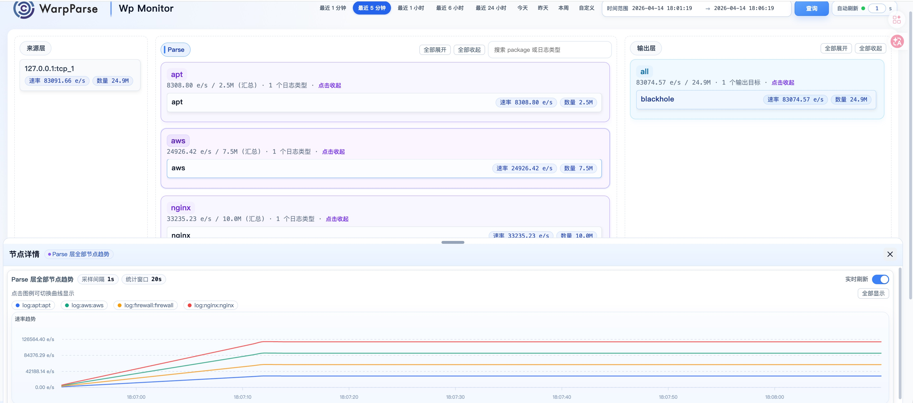

# Wp-Monitor



Wp-Monitor is the unified observation entry for WarpParse data pipelines. It helps you check whether the pipeline is processing data normally, whether MISS data is abnormal, and whether downstream output is stable.

## What You Can Observe

- Full pipeline overview: view the runtime status of Source, Parse, Sink, and MISS in one place.
- Time window observation: inspect real-time or historical behavior by time range.
- MISS data observation: check unmatched data and export it when needed.
- Trend changes: help determine whether a fluctuation is temporary or persistent.

Typical use cases:

- Daily inspection
- Troubleshooting
- Incident review

## Prerequisites

Prepare the following components first:

- VictoriaMetrics: stores and queries metric data
- VictoriaLogs: stores and queries MISS data
- WarpParse: the data pipeline being monitored

If the WarpParse pipeline has not been deployed, Wp-Monitor cannot be used.

## Setup Steps

### 1. Deploy `wp-observing`

```bash
git clone https://github.com/wp-labs/wp-compose
cd ./wp-compose/warp-observing/setup.sh
```

### 2. Configure connectors in WarpParse

If the required connectors already exist, you can skip this step.

#### VictoriaMetrics connector

```toml
[[connectors]]
id = "victoriametrics_sink"
type = "victoriametrics"
allow_override = ["insert_url", "flush_interval_secs"]

[connectors.params]
insert_url = "http://127.0.0.1:8428/api/v1/import/prometheus"
flush_interval_secs = 1
```

#### VictoriaLogs connector

```toml
[[connectors]]
id = "victorialogs_sink"
type = "victorialogs"
allow_override = ["endpoint", "insert_path", "flush_interval_secs", "create_time_field", "tags"]

[connectors.params]
endpoint = "http://127.0.0.1:9428"
insert_path = "/insert/jsonline"
```

### 3. Connect monitoring and MISS output in `sink_group`

#### `infra.d/monitor.toml`

```toml
[[sink_group.sinks]]
name = "victoriametrics"
connect = "victoriametrics_sink"
```

#### `infra.d/miss.toml`

```toml
[[sink_group.sinks]]
name = "victorialogs_output"
connect = "victorialogs_sink"
params = { endpoint = "http://127.0.0.1:9428", insert_path = "/insert/jsonline", tags = ["wp_stage:miss"] }
```

Notes:

- `tags` must include `wp_stage:miss`
- otherwise Wp-Monitor cannot query MISS data

### 4. Start WarpParse

```bash
wparse daemon --stat 1
```

`--stat 1` enables statistics output so Wp-Monitor can observe pipeline status.

## Minimal Troubleshooting Path

Recommended order:

1. Confirm the time window of the issue
2. Check whether there is an obvious fluctuation in the pipeline overview
3. Check whether MISS data increases abnormally
4. Check whether downstream output shows loss or fluctuation

If you only want a quick health check, start with the overview and MISS data in the target time window.
