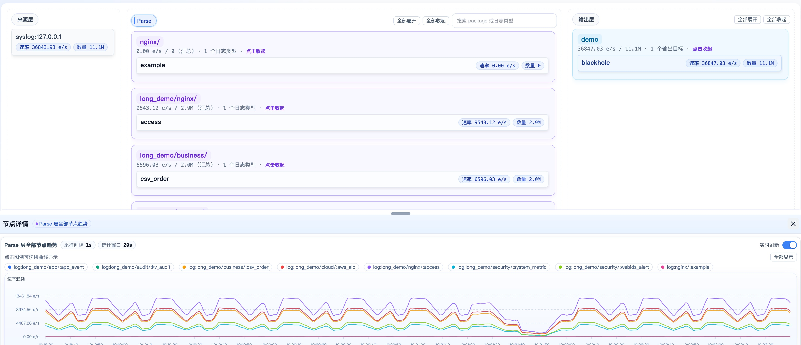
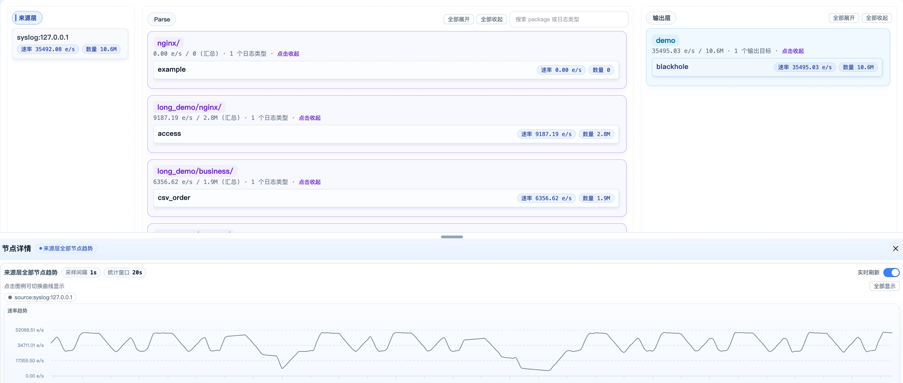

# Wp-Monitor

Wp-Monitor is a unified observation entry point for the WarpParse data pipeline, used to check whether the pipeline is processing data normally, whether MISS is abnormal, and whether downstream output is stable.

## What You Can See

- **Full-link overview**: Unified view of Source, Parse, Sink, and MISS operational status.
- **Time window observation**: View real-time or historical pipeline performance within a configurable time range.
- **MISS data observation**: Inspect data that didn't match any rules and export it for analysis when needed.
- **Trend changes**: Helps determine whether fluctuations are transient spikes or sustained anomalies.

Applicable scenarios:

- Daily inspection
- Troubleshooting
- Incident review



## Prerequisites

The following components must be prepared:

- **VictoriaMetrics**: Stores and queries metric data
- **VictoriaLogs**: Stores and queries MISS data
- **WarpParse**: The data processing pipeline being monitored

Wp-Monitor cannot be used without a deployed WarpParse pipeline.

## Setup Steps

### 1. Deploy monitor via Docker

```bash
curl -sSf https://get.warpparse.ai/inst-x.sh | bash -s -- monitor-docker alpha
```

This command generates a Docker configuration for monitor in the current directory, which can be started directly with `docker-compose -f`. Below is the directory structure:

```bash
wp-monitor
├── example                     # wparse examples
├── README.md
├── docker-compose-alpha.yml    # alpha version config
├── docker-compose-beta.yml     # beta version config
├── docker-compose-main.yml     # main version config
├── start.sh                    # startup script
└── wp-monitor                  # monitor config
    └── config
        └── app.toml
```

### 2. Configure connectors in WarpParse

Skip this step if the corresponding connectors already exist.

#### VictoriaMetrics connector

```toml
[[connectors]]
id = "victoriametrics_sink"
type = "victoriametrics"
allow_override = ["insert_url", "flush_interval_secs"]

[connectors.params]
insert_url = "http://127.0.0.1:8428/api/v1/import/prometheus"
flush_interval_secs = 1
```

#### VictoriaLogs connector

```toml
[[connectors]]
id = "victorialogs_sink"
type = "victorialogs"
allow_override = ["endpoint", "insert_path", "flush_interval_secs", "create_time_field", "tags"]

[connectors.params]
endpoint = "http://127.0.0.1:9428"
insert_path = "/insert/jsonline"
```

### 3. Configure monitor and MISS output in sink_group

#### `infra.d/monitor.toml`

```toml
[[sink_group.sinks]]
name = "victoriametrics"
connect = "victoriametrics_sink"
```

#### `infra.d/miss.toml`

```toml
[[sink_group.sinks]]
name = "victorialogs_output"
connect = "victorialogs_sink"
params = { endpoint = "http://127.0.0.1:9428", insert_path = "/insert/jsonline", tags = ["wp_stage:miss"] }
```

Note:

- `tags` must include `wp_stage:miss`
- Otherwise Wp-Monitor cannot query MISS data

### 4. Start WarpParse example (optional)

```bash
cd wp-monitor/example
wparse daemon --stat 1
# Open a new terminal and run:
cd wp-monitor/example
./wpgen-keep-running.sh
```

`--stat 1` enables statistics output so Wp-Monitor can observe pipeline status.

## Minimal Troubleshooting Path

It is recommended to check in the following order:

1. First identify the problem time window
2. Check the pipeline overview for obvious fluctuations
3. Check if MISS has abnormally increased
4. Check downstream output for loss or fluctuations

If you only need a quick health check, reviewing the overview and MISS within the time window is usually sufficient.

## Screenshots

### Source Statistics


### Parse Statistics


### Sink Statistics

