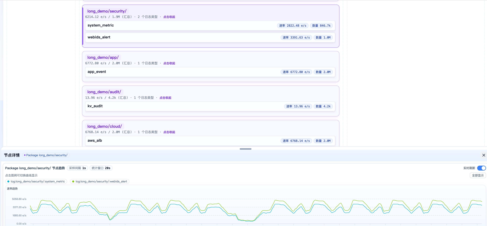
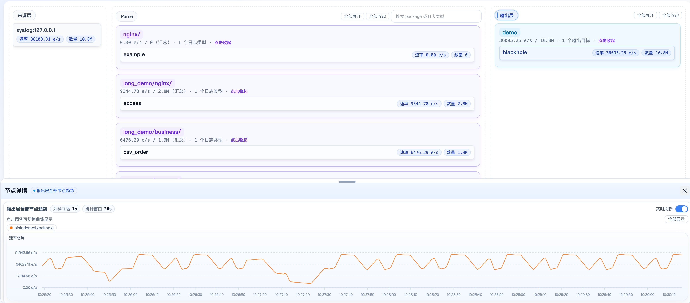

# Wp-Monitor


Wp-Monitor 是面向 WarpParse 数据链路的统一观察入口，用于查看链路是否正常处理数据、MISS 是否异常、下游输出是否稳定。

## 能看什么

- 全链路总览：统一查看 Source、Parse、Sink、MISS 的运行状态。
- 时间窗口观察：按时间范围查看实时或历史链路表现。
- MISS 数据观察：查看未命中规则的数据，并在需要时导出分析。
- 趋势变化：辅助判断波动是瞬时抖动还是持续异常。

适用场景：

- 日常巡检
- 问题排查
- 故障复盘


## 使用前提

需要先准备以下组件：

- VictoriaMetrics：存储和查询指标数据
- VictoriaLogs：存储和查询 MISS 数据
- WarpParse：被监控的数据处理链路

如果 WarpParse 链路尚未部署，Wp-Monitor 无法使用。

## 接入步骤

### 1. docker部署  monitor

```bash
curl -sSf https://get.warpparse.ai/inst-x.sh | bash -s -- monitor-docker alpha
```
该命令会在当前目录提供一个monitor的docker配置，这个配置可以直接使用 `docker-compose -f` 启动。下面是monitor的docker目录结构：
```bash
wp-monitor
├── example                     # wparse示例
├── README.md
├── docker-compose-alpha.yml    # alpha版本配置
├── docker-compose-beta.yml     # beta版本配置
├── docker-compose-main.yml     # main版本配置
├── start.sh                    # 启动脚本
└── wp-monitor                  # monitor配置
    └── config
        └── app.toml
```

### 2. 在 WarpParse 中配置 connector

如果已有对应 connector，可跳过。

#### VictoriaMetrics connector

```toml
[[connectors]]
id = "victoriametrics_sink"
type = "victoriametrics"
allow_override = ["insert_url", "flush_interval_secs"]

[connectors.params]
insert_url = "http://127.0.0.1:8428/api/v1/import/prometheus"
flush_interval_secs = 1
```

#### VictoriaLogs connector

```toml
[[connectors]]
id = "victorialogs_sink"
type = "victorialogs"
allow_override = ["endpoint", "insert_path", "flush_interval_secs", "create_time_field", "tags"]

[connectors.params]
endpoint = "http://127.0.0.1:9428"
insert_path = "/insert/jsonline"
```

### 3. 在 sink_group 中接入监控与 MISS 输出

#### `infra.d/monitor.toml`

```toml
[[sink_group.sinks]]
name = "victoriametrics"
connect = "victoriametrics_sink"
```

#### `infra.d/miss.toml`

```toml
[[sink_group.sinks]]
name = "victorialogs_output"
connect = "victorialogs_sink"
params = { endpoint = "http://127.0.0.1:9428", insert_path = "/insert/jsonline", tags = ["wp_stage:miss"] }
```

注意：

- `tags` 必须包含 `wp_stage:miss`
- 否则 Wp-Monitor 无法查询到 MISS 数据

### 4. 启动 WarpParse示例（非必须）
```bash
cd wp-monitor/example
wparse daemon --stat 1
# 开一个新终端，执行
cd wp-monitor/example
./wpgen-keep-running.sh
```
`--stat 1` 用于开启统计输出，便于 Wp-Monitor 观察链路状态。


## 最小排查路径

建议按以下顺序查看：

1. 先确定问题时间窗口
2. 查看链路总览是否存在明显波动
3. 查看 MISS 是否异常增加
4. 查看下游输出是否有损耗或波动

如果只是想快速判断链路是否正常，通常先看时间窗口内的总览和 MISS 即可。


## 效果展示：

### 来源统计数据


### 解析统计数据



### 输出统计数据

