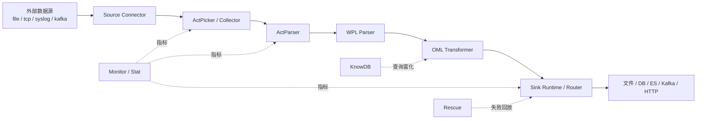

# WarpParse 架构总览

<!-- 角色：架构师 / 开发者 / 方案设计者 | 最近整理：2026-03-26 -->

本文整理 WarpParse 的整体架构，目标是回答 4 个问题：

1. WarpParse 的核心链路是什么。
2. 配置、规则、运行时分别承担什么职责。
3. 高吞吐设计主要落在哪些模块。
4. 做工程落地时，应该把注意力放在哪些边界上。

本文不展开 WPL/OML 语法细节；如果任务进入规则编写或校验，应转到对应规则文档和验证流程。

## 一句话概括

WarpParse 是一套围绕日志 ETL 构建的高性能运行时：

- 用 **Source/Connector** 负责接入数据。
- 用 **WPL** 负责把原始日志解析成结构化字段。
- 用 **OML** 负责把字段组装成目标对象。
- 用 **Sink/Route** 负责把结果发送到文件、数据库、消息系统或搜索系统。
- 用 **KnowDB / Rescue / Monitor** 提供富化、容灾和可观测能力。

## 核心特征摘要

从技术选型和系统能力上看，WarpParse 可以概括为 5 个关键点：

1. **基于 Rust 构建**：以高性能、内存安全和较强并发可控性为基础。
2. **全异步 I/O 模式**：通过异步运行时、批处理和背压调度充分利用 CPU 与 I/O 资源。
3. **自有 DSL 体系**：通过 WPL 和 OML 把“解析”和“组装”从通用脚本逻辑中抽离出来。
4. **基于接口的 Source/Sink 扩展机制**：通过统一工厂和运行时接口扩展接入与输出能力。
5. **基于接口的知识库富化机制**：通过 KnowDB 的查询门面和 Provider 形态支持运行时富化。

## 架构分层



从运行时看，主链路是：

`Source -> Collector(Picker) -> Parser -> WPL -> OML -> Sink`

从工程视角看，配置和模型分为三层：

- `conf/`：运行时主配置，例如 `wparse.toml`
- `connectors/`：连接器模板，定义某类 source/sink 的默认参数
- `models/` + `topology/`：规则、知识库、路由和实例化配置

## 工程目录与职责

典型工程目录如下：

```text
work-root/
├── conf/
│   ├── wparse.toml
│   └── wpgen.toml
├── connectors/
│   ├── source.d/
│   └── sink.d/
├── models/
│   ├── wpl/
│   ├── oml/
│   └── knowledge/
├── topology/
│   ├── sources/
│   └── sinks/
└── data/
    ├── in_dat/
    ├── out_dat/
    ├── logs/
    └── rescue/
```

可以把这些目录理解成 4 个层次：

1. `conf/` 决定进程怎么运行。
2. `connectors/` 定义“如何连接某类系统”。
3. `models/` 定义“如何解析、转换、富化数据”。
4. `topology/` 定义“哪些 source 和 sink 被启用，以及如何路由”。

这套拆分的好处是：

- 连接参数可复用，避免在每条链路上重复写一遍。
- 规则模型和接入拓扑分离，便于多人协作。
- 配置可以做白名单覆盖，降低误改连接器默认参数的风险。

## 主数据流

### 1. Source 与 Connector

Source 负责把外部数据带入 WarpParse。当前文档中常见的输入包括：

- `file`
- `tcp`
- `syslog`
- `kafka`（是否可用以当前实现和 feature 为准）

WarpParse 采用“**连接器定义** + **实例配置**”两段式模型：

- `connectors/source.d/*.toml`：定义连接器模板
- `topology/sources/wpsrc.toml`：定义具体 source 实例

实例只允许覆盖 `allow_override` 白名单中的参数。这样既保留灵活性，也防止实例层随意改掉底层协议参数。

### 2. Collector / Picker

Source 读到的数据不会直接扔给解析器，而是先进入采集调度层。

这一层的核心是 `ActPicker`：

- 管理 `pending` 缓冲队列
- 决定本轮先发多少数据给下游
- 根据水位决定是否继续从 source 拉取
- 在下游阻塞时通过轮次退避避免 CPU 自旋

它的设计原则是：

- 优先发已有缓存，再决定是否继续拉取
- 使用固定 burst、水位和轮次退避，而不是在热路径上引入复杂时间控制
- 让背压沿着有界队列自然传递

这意味着 WarpParse 的高吞吐不是“无限拉取”，而是“可控拉取 + 可解释调度”。

### 3. SourceEvent 与预处理下沉

新的运行时设计把 Source 的职责压到最小：

- Source 只负责取帧、附带最小标签和上游 IP 等元信息
- 协议级预处理不再尽量堆在 `recv` 热路径里
- 预处理通过 `SourceEvent.preproc` 挂载，转移到 parse worker 中执行

这样做的意义很直接：

- syslog header normalize/strip/tag 注入不再卡死在单一接入线程
- 预处理随着 parse worker 并行数一起扩展
- Source 端只做“接入”，Parser 端负责“消化”

这是 WarpParse 运行时设计里非常关键的一条边界。

## 解析与转换层

### 1. WPL：解析层

WPL 负责从原始日志里抽取字段，定位是“解析规则语言”。

它主要解决：

- 文本字段提取
- JSON/KV/数组等结构化内容拆解
- IP、时间、端口、HTTP 等类型识别
- 预处理和字段级 pipe
- 可选、择一、重复扫描等复杂匹配场景

WPL 的产出不是最终对象，而是“结构化中间结果 + 命中的 rule 标识”。

### 2. OML：对象建模层

OML 接在 WPL 后面，定位是“对象组装与转换语言”。

它主要负责：

- 字段重命名和重组
- 条件判断和类型转换
- 对象、数组等输出结构构造
- 数值计算
- 通过 SQL/KnowDB 进行富化

运行时通常先命中 WPL 规则，再根据 `rule = /package/rule` 去匹配 OML 配置。

可以把它理解成：

- WPL 关注“从哪里抽出什么”
- OML 关注“最终要交付成什么”

### 3. KnowDB：富化层

KnowDB 负责为 OML 或其他组件提供查询能力，典型场景包括：

- 地域、资产、组织等信息映射
- 静态知识表查找
- 运行时轻量 SQL 富化

当前设计文档里，KnowDB 默认保留“权威库”形态，再根据数据规模选择两种模式：

- 小数据、低延迟优先：线程克隆到内存
- 中大数据、内存敏感：WAL + 只读连接池

这说明 KnowDB 的定位不是在线事务数据库，而是“**运行时只读知识快照**”。

## 输出与路由层

### 1. Sink Connector

Sink 负责把结果发往目标系统，常见目标包括：

- file
- syslog
- tcp
- arrow-ipc
- kafka
- mysql / postgresql
- doris / clickhouse
- elasticsearch
- http

和 Source 一样，Sink 也分成两层：

- `connectors/sink.d/*.toml`：连接器模板
- `topology/sinks/business.d|infra.d/**/*.toml`：业务路由和基础路由

### 2. 路由模型

WarpParse 的 sink 路由分为两类：

- `business.d/`：面向具体业务场景的输出
- `infra.d/`：系统级输出，例如 `default`、`miss`、`residue`、`error`、`monitor`

这里的关键思路是：

- 业务输出和系统兜底输出分开治理
- 路由可以按 `oml` 或 `rule` 进行匹配
- 每个 sink 可以单独配置 `filter` 和 `expect`

其中：

- `filter` 是拦截条件，命中后不写该 sink，而是进入 `intercept`
- `expect` 用于做比例或范围校验，帮助发现规则漂移、路由异常或输出丢失

## 高吞吐设计落点

如果只看用户文档，很容易把 WarpParse 理解成“WPL 很强”。但从架构上看，它的性能优势不只来自规则语言，还来自运行时设计。

### 0. Rust 与异步运行时基础

WarpParse 的底层基础是 Rust。

这带来几层直接收益：

- 在系统级语言里保持较高性能上限
- 借助所有权和借用模型降低内存安全风险
- 更适合构建长时间运行的并发数据处理链路

在此基础上，运行时采用异步 I/O 模式来组织网络接入、批处理和任务协作：

- 网络 Source 和部分 Sink 使用异步接口
- 通过有界通道、任务组和异步调度组织上下游
- 让 CPU 密集的解析工作与 I/O 密集的接入/发送更好地并行

最终目标不是“所有代码都异步”，而是让 I/O 等待、批处理和解析并发各自落在合适的位置上。

### 1. Source 最小化

- Source 负责接入，不负责做过多逻辑处理
- 协议预处理被后移到 parse worker
- 有助于减少接入线程热点

### 2. 有界队列与背压

- Source 内部和 Collector 之间使用 bounded channel
- Picker 不盲目拉取，按 burst 和水位控制节奏
- 下游阻塞时，上游可以自然感知而不是无限堆内存

### 3. Zero-Copy

TCP 路径上引入 `Arc<Vec<u8>>` / `RawData::ArcBytes`：

- 降低 Source -> Parser -> Sink 之间的重复拷贝
- 对高吞吐、小包密集场景更有价值
- 配合批处理和缓冲 shrink，控制内存峰值

### 4. 批处理

批处理不是附加优化，而是运行时基线能力的一部分：

- 源端按事件数和字节上限构批
- Picker 在高水位时做小批合并
- Sink 侧也可按目标协议做批量发送

### 5. 工具链与运行模式分离

WarpParse 把“开发、验证、运行、恢复”拆成了独立工具：

- `wproj`：初始化、检查、统计
- `wpgen`：生成测试数据
- `wparse`：批处理或 daemon 运行
- `wprescue`：回放 rescue 数据

这意味着日常工程操作不需要把所有事情都塞进主进程。

## 可用性、容灾与可观测

### 1. 运行模式

`wparse` 支持两种核心模式：

- `batch`：读完即退，适合离线验证、回归和文件处理
- `daemon`：常驻运行，适合网络接入和在线链路

架构上的重要差异是：

- `batch` 不启动 acceptor，目标是源结束后优雅退出
- `daemon` 才启动监听类组件并常驻等待连接

### 2. Rescue

当 sink 侧需要兜底时，WarpParse 使用 rescue 目录保存失败数据。

当前设计不是简单地把格式化文本备份下来，而是记录结构化 JSON 行：

- `Record`：可还原成结构化记录
- `Raw`：保留原始字符串

恢复时通过 `wprescue` 或运行时恢复链路重新走 `send_record/send_raw`，尽量保证“恢复后的行为和实时发送一致”。

### 3. Monitor / Stat

统计配置允许分别观察：

- pick 阶段
- parse 阶段
- sink 阶段

这比只看一条总 TPS 更有价值，因为它能帮助判断瓶颈是在：

- 接入
- 解析
- 富化/转换
- 下游输出

## 扩展点

WarpParse 的扩展主要落在两类地方。

### 1. Connector 扩展

通过实现 `SourceFactory` / `SinkFactory`，可以引入新的 source 或 sink 类型。

核心约束是：

- 先把动态参数收敛成静态 `Spec`
- `validate_spec` 只做校验和转换
- `build` 只消费已经校验过的 `Spec`
- 统一在 registry/startup 中注册

这意味着 WarpParse 的接入与输出体系本质上是“**基于接口的扩展架构**”：

- 新增一种 Source，不需要改写整条主链路
- 新增一种 Sink，不需要侵入 WPL/OML 层
- 运行时只依赖统一 trait 和 build 结果，而不依赖某个具体实现

### 2. PipeProcessor 扩展

如果内置 WPL pipe 不够，可以通过 `PipeProcessor` 注册自定义处理器：

- 适合做解码、格式化、验证等局部能力扩展
- 不需要改动整条运行时主链路
- 仍然保持 WPL 的声明式调用方式

这类扩展应当优先用于“局部数据处理能力补充”，而不是把整套业务逻辑塞回通用脚本运行时。

### 3. 知识库富化扩展

知识库富化同样是接口化设计，而不是把查询逻辑写死在规则层。

当前设计文档中可以看到：

- KnowDB 通过统一的 `QueryFacade` 暴露查询能力
- 底层 Provider 可以是线程克隆内存模式、WAL + 连接池模式，或纯内存模式
- OML 和运行时消费的是统一查询能力，而不是直接绑定某个 SQLite 连接实现

这使得知识库富化具备两个工程价值：

- 富化能力可以独立演进，而不破坏主链路
- 运行时可以按数据规模和资源模型切换具体承载方式

## 设计边界

在工程落地时，最容易混淆的是下面几组边界。

### 1. `wproj check` 通过，不等于链路已跑通

`wproj check` 主要验证：

- 配置是否可解析
- connectors / routes / rules / models 是否存在明显问题

但这并不等于：

- 真实数据一定命中目标 WPL
- OML 一定按预期匹配
- Sink 已经正确连接目标系统

真正的落地验证仍然要看：

- `wparse batch`
- `wproj data stat`
- `miss.dat`
- `error.dat`
- 业务目标 sink 的实际输出

### 2. WPL/OML 是模型，不是部署系统

规则和模型解决的是“怎么解析、怎么组装”，不负责：

- source/sink 生命周期管理
- 背压调度
- 故障回放
- 监控与统计

这些问题属于运行时架构，而不是规则语言本身。

### 3. KnowDB 是只读富化组件，不是主业务数据库

它适合承载：

- 快照化知识表
- 查表富化
- 轻量查询

不适合承载：

- 高频写入
- 联机事务处理
- 复杂跨系统一致性场景

## 典型落地路径

如果要从零开始接入一条日志链路，推荐顺序是：

1. `wproj init --mode full` 初始化标准工程目录。
2. 配置 `conf/wparse.toml`、`connectors/` 和 `topology/sources`。
3. 准备代表性样本，完成 WPL/OML。
4. 用 `wparse batch` 跑样本，观察 `miss/error/default` 等输出。
5. 配置业务 sink 与 infra sink。
6. 在 batch 模式完成回归后，再切换到 daemon/在线接入。
7. 为目标链路补齐 `expect`、monitor、rescue 和恢复策略。

这条路径体现了 WarpParse 的正确使用方式：

- 先做可复现的离线验证
- 再做在线接入
- 最后补齐容灾、观测和治理

## 总结

WarpParse 的核心不是单一规则语言，而是一个围绕日志 ETL 构建的分层系统：

- **Connector 层**负责接入和输出。
- **Collector/Picker 层**负责背压与调度。
- **WPL/OML 层**负责解析、转换和富化。
- **KnowDB/Rescue/Monitor 层**负责运行时增强能力。

如果从工程角度理解它，可以把 WarpParse 看成：

**一套“规则驱动 + 连接器驱动 + 背压友好”的日志处理运行时。**

如果从系统能力角度压缩总结，则是：

- **Rust** 提供性能与内存安全基础。
- **全异步 I/O + 批处理 + 背压** 提供高吞吐运行时。
- **WPL / OML DSL** 提供语义化规则建模能力。
- **Source / Sink trait** 提供可扩展的接入与输出体系。
- **KnowDB QueryFacade** 提供可扩展的知识富化机制。

## 延伸阅读

- [Wparse 运行配置规范](../10-user/02-config/01-wparse.md)
- [Sources 配置总览](../10-user/02-config/02-sources.md)
- [Sink 配置](../10-user/02-config/03-sinks.md)
- 深入设计文档位于仓库 `wp-core-docs/30-design/`：
  `01-architecture.md`、`02-event_prehook.md`、`03-pick_policy.md`、
  `06-zero_copy.md`、`08-knowledge_db.md`、`09-rescue.md`
