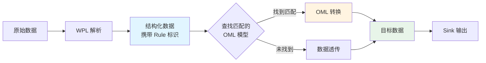
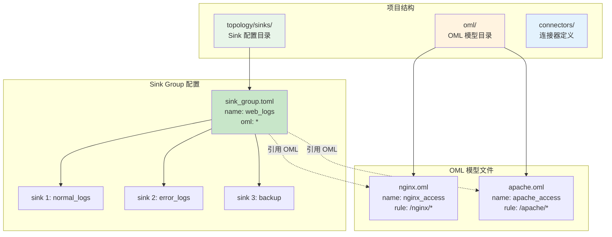

# OML的应用

## 目录

1. [核心概念](#核心概念)
2. [配置结构](#配置结构)
3. [OML 与 Sink Group 关联](#oml-与-sink-group-关联)
4. [条件路由](#条件路由)
5. [完整示例](#完整示例)
6. [工作流程](#工作流程)
7. [故障排查](#故障排查)
8. [最佳实践](#最佳实践)

## 核心概念

### OML 在数据流中的作用

在 WP Engine 数据处理流水线中，OML 扮演**数据转换引擎**的角色：



### 关键概念

- **WPL Rule（规则路径）**：标识数据来源和类型（如 `/nginx/access_log`）
- **OML Model（对象模型）**：定义如何转换数据的 OML 配置文件
- **Sink Group（输出组）**：定义数据输出的目标集合
- **规则匹配（Rule Matching）**：通过通配符将 WPL Rule 与 OML Model 关联

## 配置结构

### 配置文件关系



### Sink Group 配置文件

Sink Group 配置文件通常位于 `topology/sinks/` 目录下，使用 TOML 格式：

```toml
version = "2.0"

[sink_group]
name = "业务日志组"        # 输出组名称
oml = ["*"]               # 关联的 OML 模型（通配符）
rule = []                 # 可选：限定处理的 WPL 规则
parallel = 1              # 可选：并行度（默认 1）
tags = ["env:prod"]       # 可选：组级标签

[[sink_group.sinks]]
name = "错误日志"
connect = "file_json_sink"   # 连接器 ID
tags = ["type:error"]        # 可选：Sink 级标签

[sink_group.sinks.params]
file = "error.json"
```

### OML 模型文件

OML 模型文件通常位于 `oml/` 目录下，使用 `.oml` 扩展名：

```oml
name : nginx_access
rule : /nginx/*           # 匹配的 WPL 规则（通配符）
---
# 字段转换定义
user_id : chars = take(user_id);
occur_time : time = take(time);
status : digit = take(status_code) { _ : digit(0) };
uri : chars = take(request_uri);
```

## OML 与 Sink Group 关联

### 关联方式

Sink Group 通过 `oml` 字段与 OML 模型建立关联：


#### 1. 指定模型名称

```toml
[sink_group]
name = "nginx_logs"
oml = ["nginx_access", "nginx_error"]  # 仅使用这些 OML 模型
```

**工作原理**：
- 只在指定的 OML 模型列表中查找匹配
- 适用于明确知道需要哪些 OML 模型的场景

#### 2. 空列表（直通）

```toml
[sink_group]
name = "raw_logs"
oml = []  # 不使用任何 OML 转换
```

**工作原理**：
- 数据不经过 OML 转换，直接透传
- 适用于不需要数据转换的场景

### 匹配规则

**OML 模型匹配逻辑**：


**示例**：

| OML rule 字段 | 数据 WPL Rule | 是否匹配 |
|--------------|--------------|---------|
| `/nginx/*` | `/nginx/access_log` | ✅ 匹配 |
| `/nginx/*` | `/nginx/error_log` | ✅ 匹配 |
| `/nginx/access*` | `/nginx/access_log` | ✅ 匹配 |
| `/nginx/access*` | `/nginx/error_log` | ❌ 不匹配 |
| `*` | 任意规则 | ✅ 匹配 |
